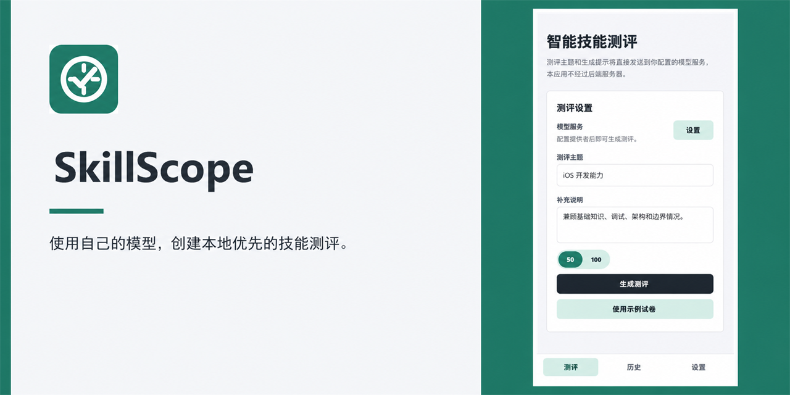

# SkillScope

> Generate, take, and review skill assessments on web/native, plus an EdgeOne-backed WeChat Mini Program release path.

[](https://github.com/KevinChen-1220/technicalEvaluation/actions/workflows/ci.yml)
[](https://github.com/KevinChen-1220/technicalEvaluation/actions/workflows/pages.yml)
[](LICENSE)
[](https://expo.dev/)
[](https://www.typescriptlang.org/)



## Demo

Try the public web demo at [SkillScope on GitHub Pages](https://kevinchen-1220.github.io/technicalEvaluation/).

## What It Does

- Creates fixed 50-question assessments from a topic and optional focus notes.
- Accepts single-choice, multiple-choice, and true/false questions.
- Scores attempts locally, with knowledge-point breakdowns and answer explanations.
- Saves in-progress drafts and completed assessments for later review.
- Web/native connects directly to the OpenAI-compatible provider you choose.
- WeChat Mini Program uses EdgeOne Node Functions for model calls, content safety, sync, history, privacy consent, and reports.

## Privacy And Storage

SkillScope's web/native app is local-first and bring-your-own-provider. Your topic, optional notes, and generation prompt are sent directly from your device to the configured model provider. The public web demo does not proxy requests, run analytics, or collect assessment data.

- Assessment papers, answers, scores, drafts, and non-secret provider settings (base URL and model) are stored locally in SQLite (`skill_scope.db`).
- On native platforms, the API key is stored with Expo SecureStore when it is available.
- When SecureStore is unavailable, including the web experience, the API key can fall back to browser-local storage for the site origin. Browser local storage is not equivalent to hardware-backed secure storage: anyone who can use that browser profile, and scripts running in that origin, may be able to read it.
- The WeChat Mini Program stores owner-isolated assessment data, generation jobs, privacy consent, and reports in EdgeOne Blob. Model keys and content-safety credentials stay in EdgeOne server-side environment variables.

Use the web experience only on a trusted personal device. Do not save a provider key in a shared or public browser; prefer a limited, revocable key and clear the site data when you are finished.

## Prerequisites

- Node.js 22 or later, including npm
- An OpenAI-compatible provider endpoint, API key, and model name to generate new assessments
- Expo Go or a local Android/iOS development environment when running on a device
- Optional for WeChat: WeChat DevTools, a real Mini Program AppID, an EdgeOne Makers project, and production compliance materials

## Get Started

```sh
git clone https://github.com/KevinChen-1220/technicalEvaluation.git
cd technicalEvaluation
npm install
npm run start
```

For a browser session, run:

```sh
npm run web
```

### Configure A Provider

For web/native local use:

1. Open the **Settings** tab.
2. Enter the provider's OpenAI-compatible base URL, such as `https://api.openai.com/v1`.
3. Enter your API key and the model name offered by that provider.
4. Choose **Save**, then **Test** to verify the connection.
5. Return to **Assess**, set a topic and optional notes, and select **Generate**.

Keep credentials out of source code, issues, screenshots, and logs. A provider must expose the OpenAI-compatible `POST /chat/completions` endpoint.

For WeChat Mini Program production, configure provider and content-safety values only in EdgeOne server-side environment variables. Do not put model keys in `TARO_APP_*`, `project.config.json`, GitHub issues, or screenshots.

## Architecture

```text
App.tsx
  -> Settings: provider base URL, model, and API key
  -> Assessment: prompt -> configured provider -> validated assessment
  -> Local scoring, explanation review, drafts, and history
  -> SQLite database (assessment records and non-secret settings)

apps/wechat
  -> Taro pages: generate, answer, result, history, settings, privacy, report
  -> Authenticated HTTPS calls: generation jobs, sync, scoring, settings, reports

services/edgeone
  -> Owner-isolated data contracts, EdgeOne Node Functions, moderation, retention
```

| Path | Purpose |
| --- | --- |
| `App.tsx` | React Native application screens and user flow |
| `packages/assessment-core/` | Shared assessment contracts, validation, scoring, and language helpers |
| `src/features/assessment/` | Generation, validation, scoring, drafts, and history |
| `src/features/config/` | Provider configuration, SecureStore handling, and browser fallback |
| `src/storage/database.ts` | Shared Expo SQLite connection |
| `src/services/aiClient.ts` | Direct OpenAI-compatible chat-completions client |
| `apps/wechat/` | Taro WeChat Mini Program shell and client sync flow |
| `services/edgeone/` | EdgeOne Node Functions, Blob-backed repositories, and release tests |
| `services/cloudbase/` | Legacy-only CloudBase migration reference and safety tests, not the production backend |
| `docs/wechat/` | WeChat privacy, release, deployment, evidence, and review handoff documents |
| `public/` | Web metadata, icons, and the social preview |

## Development And Verification

```sh
npm test -- --runInBand
npm run typecheck
npm run verify:github-workflows
npm run build:web
npm run verify:web
```

`npm run build:web` exports the static web application to the ignored `dist/` directory. `npm run verify:web` validates the generated web metadata and repository base path.

### 微信小程序 / WeChat Mini Program

```sh
npm run test:wechat -- --runInBand
npm run test:edgeone -- --runInBand
npm run typecheck:wechat
npm run typecheck:edgeone
npm run build:edgeone
npm run build:weapp
npm run verify:wechat-release
```

The shared WeChat project config keeps `touristappid`. Copy `apps/wechat/project.private.config.example.json` to `apps/wechat/project.private.config.json` for a real AppID, and keep upload keys under ignored local paths.

Release handoff docs:

- [WeChat release checklist](docs/wechat/release-checklist.md)
- [EdgeOne deployment runbook](docs/wechat/deployment-runbook.md)
- [WeChat review submission guide](docs/wechat/review-submission.md)
- [Release completion matrix](docs/wechat/release-completion-matrix.md)
- [Machine-readable release manifest template](docs/wechat/release-manifest.template.json)

## Project Status

SkillScope is open source, with the GitHub Pages web demo as its current public release. The WeChat Mini Program implementation is locally release-ready, but formal publication still requires the real WeChat subject, AppID, filing, production EdgeOne environment variables, a stable HTTPS request domain, DevTools upload credentials, real-device smoke, and WeChat review approval.

## Contributing, Security, And License

- Read [Contributing](CONTRIBUTING.md) for setup and pull-request expectations.
- Follow the [Code of Conduct](CODE_OF_CONDUCT.md) when participating.
- Report vulnerabilities privately through the guidance in [Security](SECURITY.md); never include API keys or tokens in public reports.
- SkillScope is available under the [MIT License](LICENSE).
