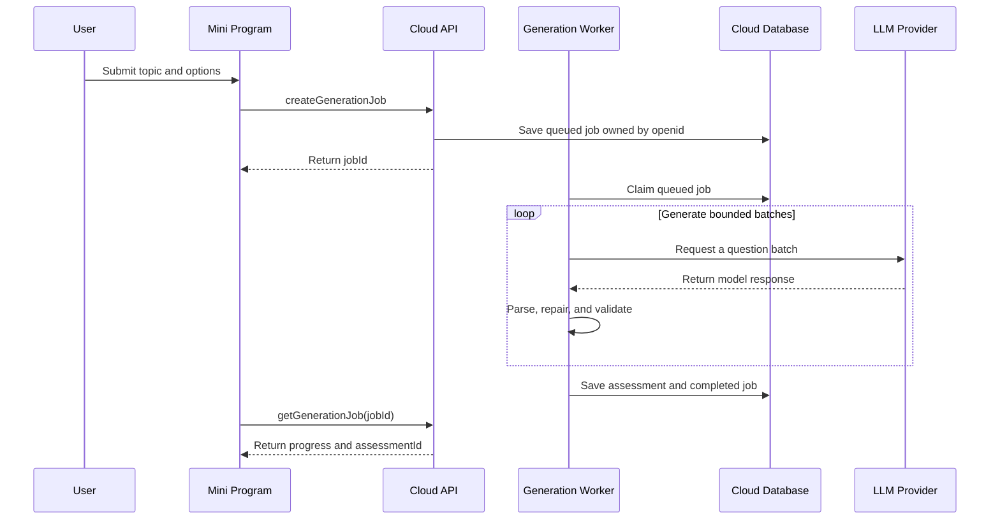

# WeChat Mini Program Design

## Goal

Publish SkillScope as a WeChat Mini Program without duplicating the assessment rules or exposing LLM credentials in the client. The Mini Program should preserve generation, answering, draft resume, history, scoring, and inline wrong-answer review while using cloud-backed persistence across devices.

## Recommended Architecture

Use Taro 4 with React for the Mini Program UI, extract framework-independent assessment logic into a shared TypeScript package, and use Tencent CloudBase for identity, database storage, generation jobs, and the LLM proxy.

```text
apps/mobile/                 Expo application
apps/wechat/                 Taro 4 React Mini Program
packages/assessment-core/    Types, validation, scoring, navigation, review models
services/cloudbase/           Generation API, jobs, persistence, provider secrets
```

The repository can move to this layout incrementally. The first migration only extracts modules that have no React Native, Expo, SQLite, or browser dependencies. The existing Expo app must keep working throughout the migration.

## Alternatives Considered

### WebView wrapper

Wrapping the current web build is the quickest prototype, but it gives weak platform integration, adds domain and review constraints, and does not solve secret management. It is not the release architecture.

### Native WXML and WXSS rewrite

A native rewrite provides maximum platform fidelity but duplicates the React UI and slows feature parity. It is not justified for the first release.

### Taro 4 with shared core

Taro keeps React and TypeScript in the stack while compiling to WeChat components. Platform UI still uses `@tarojs/components` and Mini Program routing rather than React Native primitives. This is the recommended balance of reuse and maintainability.

## Product Surface

The first Mini Program release contains five routes:

1. Generate: topic, optional notes, question count, and generation progress.
2. Answer: rich question materials, choices, progress, and draft persistence.
3. Result: score, knowledge metrics, and wrong questions expanded inline.
4. History: draft and completed assessments, with draft resume at the first unanswered question.
5. Settings: user preferences and privacy information only.

Model endpoint, API key, and raw provider configuration are deliberately absent from Mini Program settings. Those values are deployment secrets controlled by the service operator.

## Shared Assessment Core

`packages/assessment-core` owns only deterministic code:

- assessment and rich-material types;
- generated-paper validation and normalization;
- scoring and knowledge-point summaries;
- first-unanswered navigation;
- wrong-question review models;
- prompt contract and robust response parsing where environment APIs are not required.

The package must not import React, React Native, Expo SQLite, Taro, `wx`, or CloudBase. Both clients run the same fixture and contract test suite to prevent behavior drift.

## Generation Flow

Large papers are generated as asynchronous jobs instead of one long Mini Program request.



The worker generates bounded batches, validates every batch, rejects duplicate IDs, and validates the assembled paper before persistence. It records a safe error code and retryability, not raw credentials or sensitive provider responses. A completed paper is persisted before the client opens question one.

## Storage Model

CloudBase is the source of truth; Taro local storage is a responsive cache.

### `generation_jobs`

- `_id`, `_openid`, `status`, `progress`, `request`;
- `assessmentId`, `errorCode`, `retryable`;
- `createdAt`, `updatedAt`, `expiresAt`.

### `assessments`

- `_id`, `_openid`, `status`, `paper`;
- `answers`, `score`, `knowledgeStats`;
- `createdAt`, `updatedAt`, `completedAt`;
- optimistic `revision` number.

### `user_settings`

- `_openid`, locale and non-sensitive display preferences;
- privacy-consent version and timestamps.

Every assessment change is written locally immediately and queued for cloud synchronization. Cloud writes use `revision` to prevent an older device from overwriting newer answers. Opening history refreshes from cloud and then reconciles pending local writes.

## Rich Content

Text, tables, and bar charts render from the existing structured material contract. HTTPS images use the Mini Program image component and must come from configured download domains or CloudBase storage. Generated HTML, Markdown, and arbitrary web content remain unsupported.

## Security and Compliance

- Keep provider API keys and endpoints in CloudBase environment secrets.
- Authorize every job and assessment by the current WeChat identity; never trust a client-supplied owner ID.
- Enforce topic, notes, count, response-size, rate, and daily quota limits on the server.
- Apply input and output content-safety checks and provide a report/complaint entry.
- Publish a privacy policy and complete the WeChat privacy declaration before review.
- Complete Mini Program filing and select a category consistent with the actual assessment service.
- Use a model that satisfies applicable mainland China generative-AI requirements, and disclose the model/filing information where required.
- Avoid collecting phone numbers or profile data in the first release; WeChat identity is sufficient for ownership.

## Release Environments

Use separate CloudBase environments and Mini Program configuration for development and production. Development uses test users and quotas. Production secrets, database rules, indexes, domains, and monitoring are provisioned independently.

Required external prerequisites:

- verified WeChat Mini Program account and AppID;
- selected service category and required qualifications;
- CloudBase development and production environments;
- production LLM provider and server-side credentials;
- registered request/download domains where CloudBase native access does not cover them;
- completed filing, privacy declaration, and review materials.

## Observability and Failure Recovery

Track job latency, batch retries, parse failures, validation failures, provider errors, and completion rates without logging secrets or full user notes. A stale worker lease returns a job to the queue. Retrying a failed job creates a new attempt linked to the original request and never duplicates a completed assessment.

## Acceptance Criteria

- A new user can generate, answer, leave, resume, submit, and reopen an assessment on two devices.
- A generated paper is saved before answering begins, and each answer syncs after change.
- A 100-question request does not rely on one long client request.
- Rich text, table, chart, and image-fallback fixtures match the Expo application's behavior.
- No LLM secret or operator endpoint appears in the Mini Program package or network payloads.
- Development, preview, real-device, privacy, filing, and review checklists are complete before production submission.

## Primary References

- Taro getting started: https://docs.taro.zone/docs/GETTING-STARTED
- Taro React support: https://docs.taro.zone/docs/react-overall
- Taro components: https://docs.taro.zone/docs/components-desc/
- CloudBase overview: https://cloud.tencent.com/document/product/876/18431
- CloudBase Mini Program initialization: https://cloud.tencent.com/document/product/876/121103
- CloudBase environments: https://cloud.tencent.com/document/product/876/18438
- MIIT mobile application filing notice: https://www.gov.cn/zhengce/zhengceku/202308/content_6897341.htm?type=mobile-internet
- Interim Measures for Generative AI Services: https://www.cac.gov.cn/2023-07/13/c_1690898327029107.htm
- Generative AI application disclosure notice: https://www.cac.gov.cn/2024-04/02/c_1713729983803145.htm
